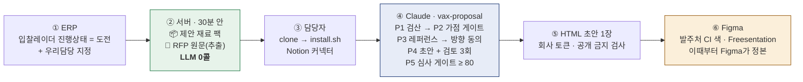

<div align="center">

# 📦 vax-proposal-kit

### 공고가 「도전」이 되는 순간, 제안서 재료가 위키에 도착하고 — 사람과 Claude가 게이트를 넘으며 초안을 쓴다

**입찰 제안 하네스 · 서버는 재료만, 판단·문장·디자인은 사람 + 개인 Claude**

[](skills/vax-proposal/SKILL.md)
[](#-게이트--느낌으로-통과하지-않는다)
[](server/README.md)
[](server/proposal_material.py)
[](fonts/README.md)
[](fonts/OFL.txt)

<br>

> **"제안서는 배치 작업이 아니라 판단 작업이다."**  
> 없는 실적을 지어내는 사고를 막으려면 사람이 중간에 검문해야 한다.  
> 그래서 서버는 **재료**를 만들고, 초안은 **사람 곁의 Claude**가 쓴다. — 한준, 2026-09-04

</div>

---

## ⚡ 60초 시작

```bash
git clone https://github.com/vaxport123/vax-proposal-kit
cd vax-proposal-kit && bash install.sh     # 스킬 → ~/.claude/skills · 글꼴 → 사용자 글꼴 폴더 (관리자 권한 불필요)
bash doctor.sh                             # 스킬·글꼴·파이썬·렌더러·저장소 점검 + 커넥터 확인 방법
```

그다음 Claude에 Notion 커넥터를 연결하고 이렇게 말한다.

> **"R26BK01711646 제안 진행해줘"**

재료 팩을 읽고 → 평가표를 검산하고 → 가점 게이트를 넘고 → 레퍼런스를 붙이고 → 방향을 제안해 **동의를 묻는다.** 동의 뒤에 초안을 쓴다.

<details>
<summary>설치 옵션</summary>

```bash
bash install.sh --list       # 무엇이 깔리는지 미리보기
bash install.sh --no-fonts   # 글꼴 제외
bash install.sh --force      # 덮어쓰기
```
`marketplace` 항목(fluent-korean · humanize-korean · claw-hwp)은 스크립트가 못 깐다 — 출력되는 `/plugin` 명령을 Claude Code에서 1회 실행한다.
글꼴은 설치 뒤 Figma·PowerPoint·브라우저를 다시 열면 보인다.
</details>

---

## 🔁 흐름 — ERP에서 Figma까지



| 단계 | 누가 | 무엇을 | 어디에 |
|---|---|---|---|
| ② | 서버 `proposal_material.py` | 캐시·덤프·학습 DB·위키 색인을 열 개 절로 모은다. 판본이 같으면 다시 쓰지 않는다 | 공고 페이지의 자식 페이지 2개 |
| ④ | 개인 Claude + `vax-proposal` | 재료 팩만 근거로 쓴다. 없는 것은 `⚠️ 확인필요`로 남긴다 | `bids/<사업명>/` (git 제외) |
| ⑤ | `scripts/render_html.py` | 마크다운 → 회사 디자인 HTML. 서버 주소·토큰이 섞이면 렌더를 거부한다 | 로컬 |
| ⑥ | Figma MCP | HTML을 슬라이드로. 강조색 한 자리만 발주처 CI로 바꾼다 | Figma |

---

## 🚧 게이트 — 느낌으로 통과하지 않는다

| 게이트 | 기준 | 미달 시 |
|---|---|---|
| **① 가점 (P2)** | 정량 실점 합계 **≤ 5.0** — 신용등급·실적 건수·지체상금 단계표는 **RFP 원문 표**로 센다 | 정성 비중 ≥ 70%면 사람 판단, 아니면 중단(가점미달). 회복가능 실점은 `차단사항`에 기한과 함께 |
| **② 심사 (P5)** | 심사위원 페르소나 채점 **≥ 80** — 감점 사유를 먼저 전부 쓰고, 항목마다 제안서 안 근거 위치를 인용. 못 하면 0점 | 재작성 1회(상위 3건만) → 그래도 미달이면 중단(심사미달) |

**80점은 합격선이 아니라 착수선이다.** 통과 뒤에도 「질 수 있는 지점」은 발표자료에서 보강한다.

---

## ✍️ 글의 세 기준 (한준 2026-09-04 · 09-05 "3가지에 집중")

| 기준 | 한 줄 | 어디에 |
|---|---|---|
| **RFP 기준 인사이트 — 기관을 웹에서 읽는다** | RFP 고유명사를 출발점으로 기관 홈페이지·보도자료·전년도 같은 사업·감사/회의록·상위 계획을 읽고, 「RFP 문장 ↔ 확인한 사실 ↔ 숨은 필요」로 배점 항목에 연결한다. 연결 안 되면 버린다 | [`writing.md`](skills/vax-proposal/references/writing.md) §2 → `03a_페인포인트.md` |
| **VAXPORT만의 색 — 카드 × 페인포인트** | 실물·등록·실적·사람·방식 카드에 「경쟁사가 못 쓰는 이유」를 붙이고, 페인포인트와 교차해 아이디어 열 개에서 셋을 고른다. 회사명을 가리고 읽어 경쟁사가 그대로 쓸 수 있으면 지운다 | [`writing.md`](skills/vax-proposal/references/writing.md) §3 → `03b_방향전략.md` |
| **AI 같지 않은 문장 — 말로 먼저** | 기억할 문장 하나 → 말로 먼저 → 구체에서 시작 → 한 사람 시점 → 소리 내어 읽기. AI 티는 낱말·리듬·구조 세 층에서 잡는다 | [`writing.md`](skills/vax-proposal/references/writing.md) §4 · `proposal-critic` A1~A9 |

---

## 🧪 실전 기록

| 날짜 | 공고 | 결과 |
|---|---|---|
| 2026-09-05 | 순천캠퍼스 VR 덱 두 판 비교 | 24장(네이티브)은 짜임새는 좋고 내용이 빠졌고, 46장(SVG 일괄)은 내용은 다 들어갔는데 하단 1/3 공백·13px 표·제목 중복으로 한 얼굴이 됐다. 원인은 하루에 여덟 번 덧붙인 규칙이 전부 「같게 만드는」 쪽이었기 때문. 규칙 파일 12개 → 글·덱·채점 셋으로 줄이고, 고정 좌표·장수 공식·결론 바 필수를 뺐다. 변주 규칙과 완성 덱 화면 검토를 넣었다 |
| 2026-09-04 | **순천캠퍼스 VR** (R26BK01711646) | P0~P4 완주. 재료 팩 7초·17,000자, RFP 원문 33,465자 자식 페이지. P1 검산 100점 일치 · P2 실점 2~4 통과 · P3 매칭 12건 · 웹 조사 6건으로 컨셉 도출 · 초안 v1→v4(검토 3회). 이 과정에서 스크립트 결함 4건(배점 단위·기술:가격 어순·원문 미첨부·설치 스크립트 변수)을 잡아 고쳤다 |

---

## 🗂️ 저장소 지도

```
skills/vax-proposal/            ★ 스킬 (install.sh 가 ~/.claude/skills 에 복사하는 유일한 폴더)
  SKILL.md                        절차 P0~P6 · 원칙 7 (Claude가 읽는 두뇌)
  references/
    writing.md                  ★ 글 — 세 축: 페인포인트(기관 웹 조사) · 색채(카드 × 페인포인트 → 아이디어) · 문장(말로 먼저 · AI 티 세 층) + 방향 순서 · 점검표
    deck.md                     ★ 덱 — RFP 규칙 우선 · 제목 사슬 · 본문 전체 수록 · 도식 14종 · 색·글꼴·헤더·쪽번호 · 변주 · 완성 검사
    review-rubric.md              채점 — P5 페르소나 고정 · 감점 먼저 · 근거 인용 의무 · 반복 감점 패턴
    material-pack.md              서버 ↔ 스킬 계약 — 재료 팩 열 개 절 + RFP 원문 자식 페이지
    staffing-table.md · reference-index.template.md   서식 구조 (데이터는 위키에만)
    images.md · figma-howto.md    절차 — 사진 출처·사용권 · Figma MCP 실측 요령
    guardrails.md                 공개 금지 정보 (render_html.py가 기계로 막는다)
  scripts/
    render_html.py                마크다운 → 회사 디자인 HTML 1장 (+ 공개 금지 검사)
    figures_svg.py                ```fig 블록 → SVG 도식·표 14종 (--no-title · 표 글자는 폭에 비례)
    img_fetch.py · figma_slides_helpers.js   사진 받기 + MANIFEST · Figma Slides 헬퍼(좌표는 기본값)
    ui_tokens.py                  디자인 정본 사본 (서버 ops/ui_tokens.py ← sync_tokens.sh)

server/                         서버에 두는 것의 초안·명세 (직원 PC에 설치되지 않음)
  proposal_material.py          ★ 도전 공고 → 📦 재료 팩 + 📄 RFP 원문 · LLM 0콜 · 셀프테스트 48건
  systemd/                        vax-proposal-material.timer / .service 사본
agents/proposal-critic.md       비판자 — 한글 표현 A1~A8 · AI 디자인 B1~B9 · 완성 덱 화면(PNG) 검토
loops/bid-loop/                 ★ /bid-loop 하네스 — 운행 규칙 · _STATE 상태 기계 · 야간 실행 래퍼
fonts/                          Freesentation · Paperlogy 각 9굵기 TTF (SIL OFL) + 설치기
assets/photos/                  회사 사진 81장 (회사소개서 마스터에서 추출, MANIFEST.md)
templates/company-intro/        회사소개서 마스터 v3 HTML (발표 톤 참고)
skills.tsv                      설치 매니페스트 — 승인 스킬의 정본
install.sh · doctor.sh          설치 · 점검
bids/                           (git 제외) 사업 폴더 — _STATE.md · 01~04 산출물 · logs/
```

---

## 🧩 함께 담은 스킬 (`skills.tsv`)

| 역할 | 스킬 | 출처 | 방식 |
|---|---|---|---|
| 제안 상류 | `vax-proposal` | 이 저장소 | git |
| 한국어 문체 | `fluent-korean` | snflkd/fluent-korean (MIT) | marketplace |
| AI 티 윤문 | `humanize-korean` | epoko77-ai/im-not-ai (MIT) | marketplace |
| 영어 패턴 윤문 | `humanizer` | blader/humanizer | npx |
| 제안 리서치 | `deep-research` | Weizhena/Deep-Research-skills | git |
| HWP 생성·편집 | `claw-hwp` | DoHyun468/claw-hwp | marketplace |
| docx·pptx·xlsx·pdf | `doc-gen` | Anthropic 내장 | builtin |
| HWP 변환 | `hwp-convert` | hwp-mcp 내장 | builtin |
| HTML 디자인 방향 | `frontend-design` | Anthropic 내장 플러그인 | builtin |
| Figma 삽입·편집 | Figma MCP | Figma 공식 커넥터 | builtin |
| 제안 하류 (완성 서식) | `vax-exit-kit` | vax-wiki-gateway | git |

외부 스킬은 Tools DB(01.WIKI_AI) 보안 검토를 거쳐 「사용중」이 된 것만 넣는다. 후보·보류는 넣지 않는다.

<details>
<summary>검토 대기 후보</summary>

| 스킬 | 출처 | 의견 (2026-09-04) |
|---|---|---|
| `axlabs-mckinsey-pptx` | seulee26/mckinsey-pptx (MIT) | P6 발표자료용으로 가치 있음 — 템플릿 40종 + 선택 서브에이전트, 한국어 지원. 맥킨지 톤이라 색·글꼴은 우리 것으로 다시 입힌다. Tools DB 검토 뒤 `skills.tsv`에 `marketplace` 줄로 추가 |
</details>

---

## 🧭 정본은 한 곳에

| 무엇 | 정본 | 이 저장소에는 |
|---|---|---|
| 디자인 값 | 서버 `ops/ui_tokens.py` | 사본 (`sync_tokens.sh`로만 갱신) |
| 회사 팩트·실적·인증 | 위키 회사 팩트 DB · Certifications · Projects | 없음 — 재료 팩으로 받는다 |
| 실적 ↔ 기술요소 ↔ 재활용 문구 | 위키 [레퍼런스 색인](https://app.notion.com/p/3d16394f4c9981b493e3d4b5dc7884a9) (01.WIKI_AI / Company) | 없음 — 실명·재무·신용등급은 git에 두지 않는다 |
| 인력 데이터(성명·이력·4대보험) | 위키 색인 §I · Members · 인력구성 최신본 | 서식 구조만 (`staffing-table.md`) |
| 재료 팩 목차 | `references/material-pack.md` | 서버와 스킬이 함께 지키는 계약 — 한쪽만 바꾸지 않는다 |
| 완성 디자인 | Figma | 없음 — HTML은 초안이다 |

---

## 📜 지키는 것

- 회사명·대표·실적·인증·신용등급·숫자는 **재료 팩에서만.** 임의 입력·추정·기억 인용 금지.
- 근거 없는 문장은 쓰지 않는다. `⚠️ 확인필요 — <무엇이 필요한지>`로 남긴다.
- 서버 주소·포트·모델명·채널 ID·내부 경로·토큰·임직원 실명은 산출물에 넣지 않는다. 렌더러가 기계로 막고, 실명은 사람이 본다.
- 방향(P3.5)은 사용자 동의 뒤에 전략으로 간다.
- 사람이 Figma·노션에서 고친 값이 정답이다. 되돌려 덮어쓰지 않는다.

<div align="center">
<sub>주식회사 백스포트 · 2026 · 서버 쪽 정본은 <code>vaxport123/vax-wiki-gateway</code></sub>
</div>
